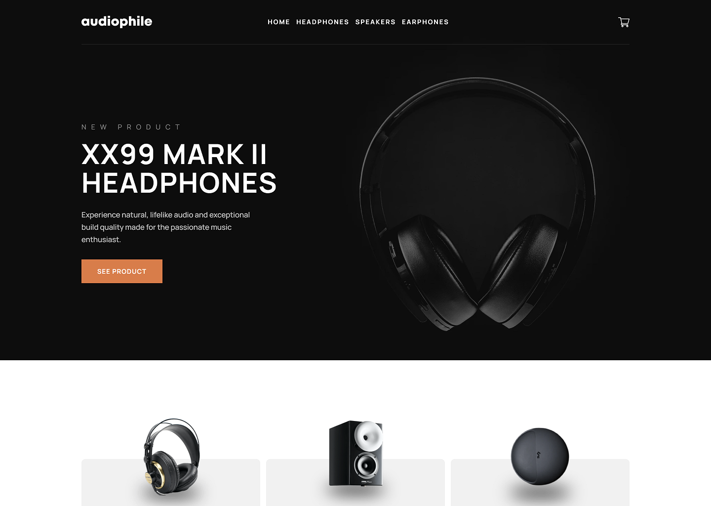

# Audiophile e-commerce website

### Links

- Live Site URL: [ScottWinn.dev](https://www.scottwinn.dev/projects/audiophile-ecommerce/)

## Table of contents

- [Overview](#overview)
  - [The challenge](#the-challenge)
  - [Screenshot](#screenshot)
  - [Links](#links)
- [My process](#my-process)
  - [Built with](#built-with)
  - [What I learned](#what-i-learned)
- [Author](#author)

## Overview

### The challenge

Users should be able to:

- View the optimal layout for the app depending on their device's screen size
- See hover states for all interactive elements on the page
- Add/Remove products from the cart
- Edit product quantities in the cart
- Fill in all fields in the checkout
- Receive form validations if fields are missed or incorrect during checkout
- See correct checkout totals depending on the products in the cart
  - Shipping always adds $50 to the order
  - VAT is calculated as 20% of the product total, excluding shipping
- See an order confirmation modal after checking out with an order summary
- Keep track of what's in the cart, even after refreshing the browser.

## My process

### Built with

- React
- Typescript
- Tailwind
- React Router
- React Hook Form

### What I learned

I used this project to explore the React Router and React Hook Form packages.

## Author

- Website - [Scott Winn](https://www.scottwinn.dev)
